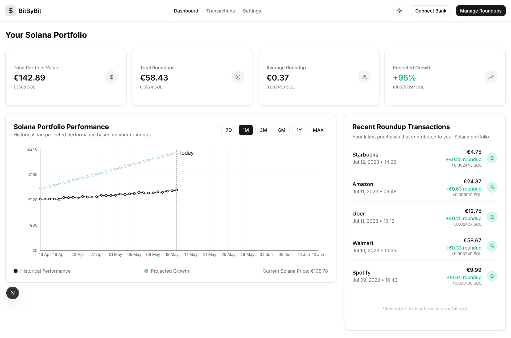

<!-- Improved compatibility of back to top link: See: https://github.com/othneildrew/Best-README-Template/pull/73 -->

<!--
*** Thanks for checking out the Best-README-Template. If you have a suggestion
*** that would make this better, please fork the repo and create a pull request
*** or simply open an issue with the tag "enhancement".
*** Don't forget to give the project a star!
*** Thanks again! Now go create something AMAZING! :D
-->

<!-- PROJECT LOGO -->
 

  

<h3 align="center">BitByBit</h3>
  

    Passively investing into crypto through round-up's
     
    <a href="https://bitbybit.money/"><strong>Join the waitlist »</strong></a>
     
    <a href="mailto:team@bitbybit.money">View Demo</a>
    &middot;
  

<!-- TABLE OF CONTENTS -->

  
Table of Contents

  <ol>
    <li><a href="#🚀-bitbybit-round-up-to-crypto-flow">🚀 BitByBit: Round-Up to Crypto Flow</a></li>
    <li><a href="#-1-user-onboarding-one-time-setup">🔑 1. User Onboarding (One-Time Setup)</a></li>
    <li><a href="#-2-daily-round-up-engine">🔄 2. Daily Round-Up Engine</a></li>
    <li><a href="#-3-scheduled-debit-weeklybiweekly">📆 3. Scheduled Debit (Weekly/Biweekly)</a></li>
    <li><a href="#-4-fiat-receipt">🏦 4. Fiat Receipt</a></li>
    <li><a href="#-5-fiat-to-crypto-conversion">🔁 5. Fiat-to-Crypto Conversion</a></li>
    <li><a href="#-6-crypto-wallet-deposit">🔐 6. Crypto Wallet Deposit</a></li>
    <li><a href="#-dashboard-preview">📊 Dashboard Preview</a></li>
    <li><a href="#-regulatory-overview">🧾 Regulatory Overview</a></li>
    <li><a href="#-authentication-summary">🔐 Authentication Summary</a></li>
    <li><a href="#-tech-stack">🛠 Tech Stack</a></li>
    <li><a href="#-coming-soon">🧪 Coming Soon</a></li>
    <li><a href="#-contact">📬 Contact</a></li>
  </ol>

<!-- ABOUT THE PROJECT -->
## About The Project

BitByBit automates spare change investments by rounding up everyday purchases and converting them into crypto. It’s fully compliant, user-friendly, and designed to make crypto accumulation effortless.

**Further Resources:**

- [Project Pitch Video](https://www.loom.com/share/4dd7997dc2854a668cff029f20a7022d?sid=bed4a354-f170-4fc4-a04c-3c2f8b7172d7)
- [Introduction by Mickey and Tobi](https://www.youtube.com/watch?v=Y_P_xHP7ObA&feature=youtu.be)
- [App Demo](https://www.youtube.com/shorts/B0yWZm9Udk8)
- [Simplified Pitchdeck Colosseum Hackathon](https://docs.google.com/presentation/d/1NBhqBm40-xloo2cgXFmCHPGuaFPpIWaB/edit?usp=sharing&ouid=110465918428847718246&rtpof=true&sd=true)
- [Pitch Deck](pitch-decks\for_investors-Crypto-Portfolios-One-Purchase-at-a-Time.pdf)

(<a href="#readme-top">back to top</a>)

# 🚀 BitByBit: Round-Up to Crypto Flow

BitByBit enables automatic round-up savings and crypto conversion directly from users’ bank accounts—independent of payment method. By integrating at the bank level (via Open Banking), we bypass cards entirely, enabling flexible, secure, and fully automated financial flows from fiat to crypto.

## 🔑 1. User Onboarding (One-Time Setup)

**Tools:** Yapily, Sumsub (KYC), Spring Boot, Dynamic.xyz

### Flow:
- Connect bank account via **Yapily**
- Complete **SCA** (OAuth + 2FA)
- Approve:
  - ✅ Read access (valid 90–180 days)
  - ✅ Payment mandate (Direct Debit or PIS)
- Complete **KYC**
- Generate custodial wallet via **Dynamic.xyz**

**Authentication Required:** ✅ Yes  
**Token Validity:** ~180 days for read access, longer for mandate

---

## 🔄 2. Daily Round-Up Engine

**Tools:** Yapily (read API), Ledger DB, Webapp UI

### Flow:
- Poll transactions up to 4x/day
- Calculate round-ups (e.g. £3.20 → £0.80)
- Store pending totals in **Ledger DB**
- Display to users in **Webapp/PWA**

**Authentication Required:** ❌ No (until token expires)

---

## 📆 3. Scheduled Debit (Weekly/Biweekly)

**Tools:** Yapily PIS or Direct Debit

### Flow:
- Aggregate round-ups on a schedule
- Trigger Direct Debit or PIS payment
- Move funds to BitByBit’s company bank account

**Authentication Required:**
- ❌ No, with Direct Debit
- ✅ Yes (lightweight), with PIS

> 💡 **Recommendation:** Prefer Direct Debit for frictionless recurring payments

---

## 🏦 4. Fiat Receipt

**Tools:** Traditional bank integration, Ledger DB

### Flow:
- Confirm fiat received in backend
- Update status on user ledger and dashboard

**Authentication Required:** ❌ No

---

## 🔁 5. Fiat-to-Crypto Conversion

**Tools:** Mercuryo API

### Flow:
- Spring triggers crypto purchase (BTC, SOL, etc.)
- Record price, timestamp, and transaction details

**Authentication Required:** ❌ No

---

## 🔐 6. Crypto Wallet Deposit

**Tools:** Dynamic.xyz

### Flow:
- Send purchased crypto to user’s custodial wallet
- Wallet is BitByBit-managed but user-linked
- Webapp shows balance + line chart for progress

**Authentication Required:** ❌ No

---

## 📊 Dashboard Preview

| Round-Up Summary | Wallet Balance | Progress Chart |
|------------------|----------------|----------------|
| 💳 £23.40 saved  | ₿ 0.0021 BTC   | 📈 30-day trend |

> Users can view:
> - Daily round-up activity
> - Crypto performance over time
> - Wallet balance in both fiat and crypto
> - Upcoming scheduled debit

 <!-- Replace with actual path -->

---

## 🧾 Regulatory Overview

| Area                        | Requirement                                              |
|-----------------------------|----------------------------------------------------------|
| Bank integration & payments | ✅ No license needed when using regulated providers      |
| Custody of user crypto      | ⚠️ MiCA license required for custodial wallets           |
| Fiat-to-crypto conversion   | ✅ Mercuryo is a licensed VASP                           |
| KYC & AML                   | ✅ Required at onboarding                                |
| Stablecoin issuance (future)| ⚠️ Triggers MiCA EMT/ART (optional)                     |

---

## 🔐 Authentication Summary

| Step                          | Authentication Required |
|-------------------------------|--------------------------|
| Onboarding                    | ✅ Yes (SCA + mandate)    |
| Daily transaction polling     | ❌ No                    |
| Weekly debit (Direct Debit)   | ❌ No                    |
| Weekly debit (PIS)            | ✅ Yes (light consent)   |
| Fiat receipt                  | ❌ No                    |
| Crypto purchase               | ❌ No                    |
| Wallet deposit                | ❌ No                    |

---

## 🛠 Tech Stack

- **Backend:** Spring Boot
- **Banking:** Yapily (Open Banking)
- **Wallets:** Dynamic.xyz (custodial)
- **KYC/AML:** Sumsub or equivalent
- **Crypto Conversion:** Mercuryo API
- **Storage:** Ledger DB
- **Frontend:** Webapp + PWA dashboard

<!-- ROADMAP -->
## 🗺 Roadmap

- [x] Map out all major components of the System (Banking, Crypto, Logic)
- [x] Get in touch with key partners like Yapily or Commerzbank
- [x] Building a clickdummy of the App 
- [x] Initial draft of the Dashboard interface
- [x] Submit inital draft at the Colosseum Hackathon
- [ ] Integrate with Open Banking API (Yapily)
- [ ] Implement user onboarding with full SCA + KYC flow
- [ ] Round-up engine: Calculate and store daily round-ups
- [ ] Scheduled Direct Debit / PIS-based payments
- [ ] Fiat-to-crypto conversion via Mercuryo
- [ ] Custodial wallet creation and deposit flow using Dynamic.xyz
- [ ] Dashboard UI: Display savings, wallet balance, and round-up insights
    - [ ] 30-day crypto value chart
    - [ ] Upcoming debit preview
- [ ] Notifications (email, PWA push)
- [ ] Native mobile app (iOS/Android)
- [ ] Support for VRP (Variable Recurring Payments)
- [ ] Stablecoin savings account integration

See the [open issues](https://github.com/github_username/repo_name/issues) for a full list of proposed features (and known issues).

(<a href="#readme-top">back to top</a>)

## 🏗 Technical Architecture

Our system is designed for modularity, scalability, and compliance — combining regulated providers with custom backend orchestration.

### 🔌 Connected Providers
We connect with three key infrastructure providers:
- **[Dynamic.xyz](https://www.dynamic.xyz)** — Wallet provider for custodial wallet creation, management, and crypto transfers.
- **[Mercuryo](https://www.mercuryo.io/)** — Regulated on/off-ramp provider for fiat-to-crypto conversions.
- **[Yapily](https://www.yapily.com/)** — Open Banking API provider for direct access to bank accounts, transactions, and payments.

---

### 🧱 System Components

#### 🧩 Wallet Provider — [Dynamic.xyz](https://www.dynamic.xyz)
Dynamic enables seamless custodial wallet creation and crypto transfers on behalf of users. Transactions are fast and cheap, especially on our target chain, **Solana**.

#### 💱 On-Offramp Provider — [Mercuryo](https://www.mercuryo.io/)
Mercuryo handles fiat-to-crypto conversion. When a user’s round-ups are aggregated and debited, the fiat is sent to BitByBit’s account and immediately converted into crypto (BTC, SOL, etc).

#### 🏦 Open Banking — [Yapily](https://www.yapily.com/)
Yapily powers our direct bank integrations. Through Strong Customer Authentication (SCA), we securely:
- Retrieve user bank transactions and balances (4x/day polling)
- Establish long-term read access and payment mandates (Direct Debit or PIS)
- Calculate round-ups based on real-time transaction history

#### 📱 User Interface — Web/PWA
A clean, mobile-first UI similar to **Trade Republic** or **Robinhood** allows users to:
- Track daily round-ups
- View wallet balance (crypto & fiat)
- See 30-day performance trends
- Know when the next debit is scheduled

#### 🧠 Backend — Spring Boot
A monolithic Spring Boot backend orchestrates all business logic:
- Interacts with Yapily, Mercuryo, Dynamic
- Manages ledger and database operations
- Serves APIs to the Webapp/PWA

> ⚙️ This monolithic setup supports rapid prototyping and can evolve into microservices as needed.

---

### 🔗 Target Blockchain: **Solana**
We chose **Solana** for:
- High throughput (10,000+ TPS)
- Low fees for frequent small-value transfers
- Strong wallet ecosystem and developer tooling

---

(<a href="#readme-top">back to top</a>)

## 🧪 Coming Soon

- 🔄 VRP (Variable Recurring Payments) support
- 💰 Stablecoin savings account
- 🔔 Push notifications for savings events
- 📱 Native mobile app

---

## 📬 Contact

For partnerships or support, contact us at [support@bitbybit.app](mailto:support@bitbybit.app)

---

© BitByBit — All rights reserved.

<!-- CONTACT -->
## Contact

Visit us at X - [@bitbybit_money](https://x.com/bitbybit_money) - team@bitbybit.money

(<a href="#readme-top">back to top</a>)

